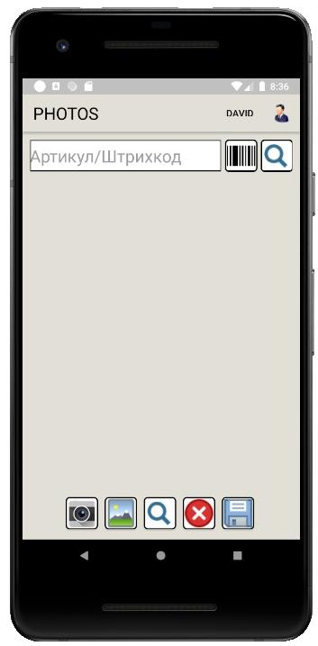
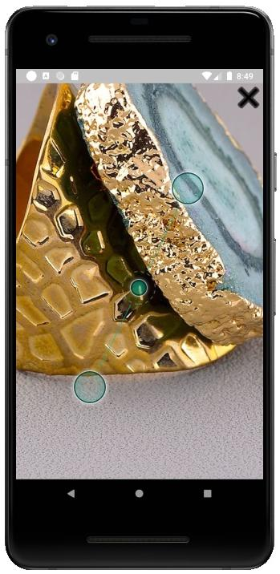

# ANDROID-product-photos

Приложение позволяет создавать новые и удалять старые фотографии товаров на сайте.
Вводим артикул товара и получаем уже имеющиеся фотографии, коотрые можно удалить или добавить новые.
Взаимодействие происходит через HTTP-сервисы запущенные на базе данныех 1С.

